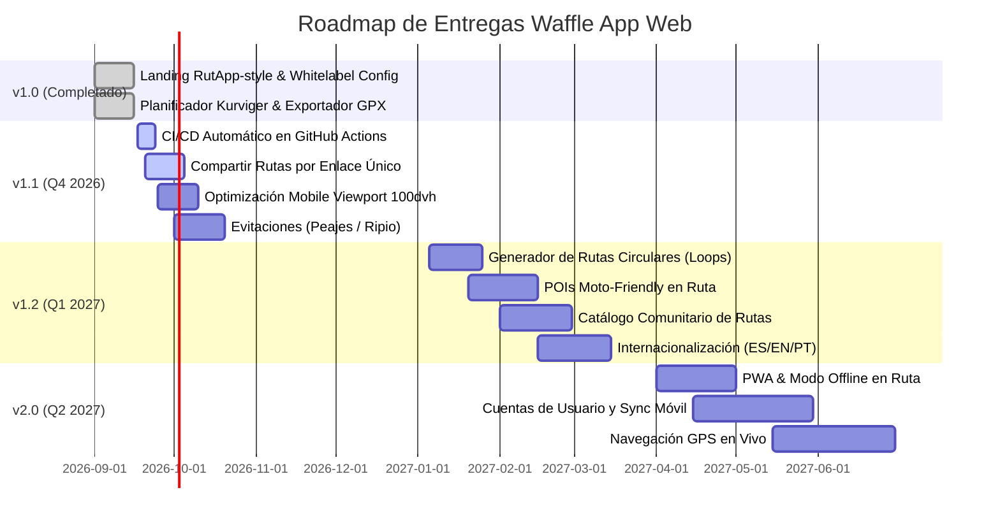

# Product Backlog — Waffle App Web 🧇🏍️

Este documento contiene el **Product Backlog** oficial de **Waffle App Web**, consolidando las mejoras funcionales, expansiones de plataforma y correcciones técnicas identificadas tras la entrega de la versión inicial (v1.0).

---

## 🧭 Metodología & Clasificación

Cada ítem del backlog se clasifica bajo los siguientes criterios:

* **Prioridad (MoSCoW)**:
  * 🔴 **Must Have (P0)**: Requerimientos críticos para la adopción y funcionalidad esencial.
  * 🟠 **Should Have (P1)**: Funcionalidades de alto valor para usuarios y comunidad.
  * 🟡 **Could Have (P2)**: Mejoras de experiencia, optimizaciones o características avanzadas.
  * ⚪ **Won't Have (P3 - Nice to have)**: Exploratorio para fases posteriores.
* **Estimación de Esfuerzo (T-Shirt Size)**: `S` (1-2 días), `M` (3-5 días), `L` (1-2 semanas), `XL` (2+ semanas).
* **Release Target**:
  * **v1.1 (Next Release)**: Usabilidad inmediata, compartir rutas, CI/CD y fixes móviles.
  * **v1.2 (Community & Pro Planner)**: Generador de bucles circulares, puntos de interés (POIs) y catálogo de rutas.
  * **v2.0 (Ecosystem & Connected App)**: Cuentas de usuario en la nube, navegación en vivo y PWA offline.

---

## 🗺️ Roadmap de Versiones

---

## 📋 Detalle de Épicas e Historias de Usuario

---

### Épica 1: Route Planner Pro (Paridad Kurviger & Algoritmos de Ruta)

*Objetivo: Elevar las capacidades del planificador web (`/plan`) para convertirlo en la herramienta predilecta de planificación de rutas de curvas en Latinoamérica.*

#### [EP1-01] Generador de Rutas Circulares (*Round-Trip Generator*)
* **Prioridad**: 🔴 P0 (Must Have)
* **Estimación**: `L`
* **Release Target**: v1.2
* **Descripción**: Permitir al motociclista definir un único punto de origen/destino y una distancia deseada (ej. 120 km) más una dirección cardinal preferida (Norte, Sur, Este, Cordillera, Costa) para que el motor calcule automáticamente un bucle de curvas sin repetir tramos.
* **Criterios de Aceptación**:
  * [ ] El usuario puede activar el toggle "Ruta Circular / Round-Trip" en el panel de waypoints.
  * [ ] Selector deslizante de distancia objetivo (50 km a 500 km).
  * [ ] Brújula de orientación para sesgar el rumbo del bucle.
  * [ ] El algoritmo genera al menos 3 waypoints intermedios evitando autopistas directas.
  * [ ] El perfil de curvas aplica el factor de sinuosidad configurado.

#### [EP1-02] Motor de Evitaciones (*Avoidances Engine*)
* **Prioridad**: 🟠 P1 (Should Have)
* **Estimación**: `M`
* **Release Target**: v1.1
* **Descripción**: Opciones configurables en el cálculo de ruta para excluir ciertos tipos de vías.
* **Criterios de Aceptación**:
  * [ ] Toggles en interfaz: "Evitar Peajes", "Evitar Autopistas", "Evitar Ripio/Tierra", "Evitar Transbordadores/Ferries".
  * [ ] Enrutamiento procedural y adaptadores externos (ORS, GraphHopper) transmiten las restricciones a la query de enrutamiento.
  * [ ] Alerta visual en el mapa si una sección no pavimentada es inevitable.

#### [EP1-03] Capas de Puntos de Interés Moto-Friendly (POIs)
* **Prioridad**: 🟠 P1 (Should Have)
* **Estimación**: `L`
* **Release Target**: v1.2
* **Descripción**: Mostrar sobre el mapa interactivo capas con iconos distintivos para estaciones de servicio, miradores panorámicos, talleres mecánicos y cafeterías/paradas de reunión para moteros.
* **Criterios de Aceptación**:
  * [ ] Selector de capas (checkboxes): Bencineras, Miradores, Talleres, Cafés.
  * [ ] Consumo de datos OpenStreetMap / Overpass API o catálogo curado en `site.config.ts`.
  * [ ] Click en un POI permite añadirlo como parada intermedia (*Via point*) a la ruta actual.

#### [EP1-04] Capa Meteorológica y Viento en Ruta (*Weather Along Route*)
* **Prioridad**: 🟡 P2 (Could Have)
* **Estimación**: `M`
* **Release Target**: v1.2
* **Descripción**: Integrar servicio del clima (ej. Open-Meteo API gratuito) que estime lluvia, temperatura y ráfagas de viento por segmento horario a lo largo del track planificado.
* **Criterios de Aceptación**:
  * [ ] Gráfico con alertas meteorológicas en el perfil de elevación (ej. lluvia sobre los 2.000 msnm).
  * [ ] Indicador de dirección y fuerza del viento con iconos sobre el mapa.

#### [EP1-05] Análisis Detallado de Superficie (*Surface Breakdown*)
* **Prioridad**: 🟡 P2 (Could Have)
* **Estimación**: `S`
* **Release Target**: v1.2
* **Descripción**: Mostrar en la barra de telemetría la distribución porcentual de superficie (ej: 85% Asfalto, 15% Ripio compactado).
* **Criterios de Aceptación**:
  * [ ] Barra de progreso multicolor segmentada por tipo de vía.
  * [ ] Hover con kilometraje exacto de cada tipo de superficie.

---

### Épica 2: Ecosistema Waffle App (Social, Guardado y Compartir)

*Objetivo: Cerrar el ciclo entre la web pública y la aplicación móvil nativa para que los usuarios puedan guardar, descubrir y compartir rodadas.*

#### [EP2-01] Compartir Rutas por Enlace Único / Deep Linking
* **Prioridad**: 🔴 P0 (Must Have)
* **Estimación**: `S`
* **Release Target**: v1.1
* **Descripción**: Generar URLs compartibles que codifiquen los waypoints y el perfil de conducción en los parámetros de la URL (`/plan?w=-33.45,-70.66|-33.35,-70.30&profile=curvy`) o vía enlaces cortos generados en servidor.
* **Criterios de Aceptación**:
  * [ ] Botón "Compartir" que copia el enlace al portapapeles y genera un código QR para escanear desde el móvil.
  * [ ] Al abrir el enlace, el planificador reconstruye los waypoints, calcula la ruta y centra el mapa automáticamente.
  * [ ] Compatible con redirección directa a la app nativa (Universal Link / App Link).

#### [EP2-02] Catálogo Comunitario de Rutas con Filtros Dinámicos
* **Prioridad**: 🟠 P1 (Should Have)
* **Estimación**: `L`
* **Release Target**: v1.2
* **Descripción**: Sección dedicada (`/rutas`) con listado paginado o buscador de rutas recomendadas por la comunidad de Waffle App.
* **Criterios de Aceptación**:
  * [ ] Filtro por tipo de moto: Trail / Maxi-Trail, Deportiva / Naked, Custom / Cruiser, Enduro, Scooter.
  * [ ] Filtro por dificultad, duración y región geográfica.
  * [ ] Vista previa en mini-mapa interactivo y botón directo para clonar en el planificador.

#### [EP2-03] Autenticación Liviana y Sincronización en la Nube
* **Prioridad**: 🟠 P1 (Should Have)
* **Estimación**: `XL`
* **Release Target**: v2.0
* **Descripción**: Inicio de sesión (Google, Apple, Email) que permita sincronizar la biblioteca de rutas entre Waffle App Web y los dispositivos móviles del usuario.
* **Criterios de Aceptación**:
  * [ ] Integración con backend (Supabase / Auth.js).
  * [ ] Pestaña "Mis Rutas Guardadas" en el sidebar del planificador.
  * [ ] Sincronización bidireccional de rutas creadas en el teléfono o en la web.

#### [EP2-04] Coordinación de Rodadas Grupales (*Group Rides*)
* **Prioridad**: 🟡 P2 (Could Have)
* **Estimación**: `L`
* **Release Target**: v2.0
* **Descripción**: Publicación de eventos de salida en grupo con punto de encuentro, hora de salida, briefing de seguridad y confirmación de asistencia.

---

### Épica 3: Experiencia Móvil, PWA & Modo Conducción

*Objetivo: Permitir que el planificador se use cómodamente en smartphones montados sobre el manillar de la motocicleta.*

#### [EP3-01] Optimización de Viewport Móvil (`100dvh`) y Gestos Táctiles
* **Prioridad**: 🔴 P0 (Must Have)
* **Estimación**: `S`
* **Release Target**: v1.1
* **Descripción**: Resolver saltos de pantalla en Safari iOS y Chrome Android causados por la barra de navegación del navegador al expandir el mapa.
* **Criterios de Aceptación**:
  * [ ] Uso de unidades dinámicas `100dvh` en `/plan`.
  * [ ] Drawers de control con pestañas táctiles arrastrables de 3 alturas (colapsado, semi-abierto, expandido).
  * [ ] Botones táctiles de zoom y orientación con área táctil ampliada (mínimo 48x48px para uso con guantes de moto).

#### [EP3-02] Progressive Web App (PWA) & Caché Offline de Tracks
* **Prioridad**: 🟠 P1 (Should Have)
* **Estimación**: `M`
* **Release Target**: v2.0
* **Descripción**: Permitir instalar la web como aplicación en la pantalla de inicio y consultar la ruta activa y el perfil de altimetría aun sin señal en pasos cordilleranos.
* **Criterios de Aceptación**:
  * [ ] `manifest.webmanifest` con iconos, theme color y modo display `standalone`.
  * [ ] Service Worker para almacenar en caché la aplicación base y el archivo GPX de la ruta en curso.
  * [ ] Indicador visual cuando el usuario está navegando en modo "Sin conexión".

#### [EP3-03] Modo Conducción / Posición GPS en Vivo (*Follow Me*)
* **Prioridad**: 🟡 P2 (Could Have)
* **Estimación**: `M`
* **Release Target**: v2.0
* **Descripción**: Botón para activar el GPS del dispositivo móvil, mostrando el marcador de posición del motociclista en el mapa con centrado automático continuo.
* **Criterios de Aceptación**:
  * [ ] API Geolocation del navegador con opción `enableHighAccuracy: true`.
  * [ ] Marcador con flecha de orientación según la brújula/bearing del dispositivo.
  * [ ] Bloqueo de reposo de pantalla (Screen Wake Lock API) mientras esté activo el modo conducción.

---

### Épica 4: Landing Promocional, SEO & Expansión Whitelabel

*Objetivo: Posicionar orgánicamente la plataforma y facilitar su personalización para marcas aliadas.*

#### [EP4-01] Internacionalización (i18n: Español / Inglés / Portugués)
* **Prioridad**: 🟠 P1 (Should Have)
* **Estimación**: `M`
* **Release Target**: v1.2
* **Descripción**: Soporte multi-idioma para toda la web y el planificador, manteniendo la filosofía de configuración centralizada.
* **Criterios de Aceptación**:
  * [ ] Configuración de diccionarios en `src/config/locales/` o expansión de `site.config.ts`.
  * [ ] Selector de idioma en el Navbar y Footer.
  * [ ] Detección automática por cabecera `Accept-Language` o prefijo de ruta (`/es`, `/en`, `/pt`).

#### [EP4-02] Guías de Rutas Icónicas & Blog de Rodadas (SEO Engine)
* **Prioridad**: 🟠 P1 (Should Have)
* **Estimación**: `M`
* **Release Target**: v1.2
* **Descripción**: Páginas estáticas optimizadas para SEO sobre las rutas de curvas más famosas de la región (ej: *Cuesta Caracoles*, *Cuesta La Dormida*, *Paso San Francisco*, *Carretera Austral*).
* **Criterios de Aceptación**:
  * [ ] Metadatos OpenGraph dinámicos con mapa de preview de la ruta.
  * [ ] Botón en cada artículo para abrir directamente el track en el planificador con un click.
  * [ ] Rich Snippets de Google (Schema.org / TouristTrip / HowTo).

#### [EP4-03] Multi-tenant Whitelabeling (Temas por Marca/Club)
* **Prioridad**: 🟡 P2 (Could Have)
* **Estimación**: `L`
* **Release Target**: v2.0
* **Descripción**: Capacidad de compilar o inyectar configuraciones visuales distintas (colores corporativos, logos y rutas por defecto) para clubes de motociclistas o concesionarios aliados.

---

### Épica 5: Calidad Técnica, Rendimiento & Infraestructura (Tech Debt & Fixes)

*Objetivo: Asegurar robustez, alta disponibilidad y facilidad de mantenimiento del código.*

#### [EP5-01] Automatización CI/CD con GitHub Actions
* **Prioridad**: 🔴 P0 (Must Have)
* **Estimación**: `S`
* **Release Target**: v1.1
* **Descripción**: Pipeline de integración continua que valide el linter, chequeo de tipos de TypeScript y build en cada pull request o push a la rama `main`.
* **Criterios de Aceptación**:
  * [ ] Workflow `.github/workflows/ci.yml` configurado y funcional.
  * [ ] Ejecución de `npm run lint`, `npx tsc --noEmit` y `npm run build`.
  * [ ] Notificación clara de fallo ante cualquier error de compilación.

#### [EP5-02] Procesamiento de GPX en Web Worker
* **Prioridad**: 🟠 P1 (Should Have)
* **Estimación**: `S`
* **Release Target**: v1.1
* **Descripción**: Cuando un usuario sube un archivo GPX pesado (>10.000 puntos o >10 MB), el análisis de elevación y coordenadas actualmente puede ralentizar la UI. Mover esta lógica a un Web Worker.
* **Criterios de Aceptación**:
  * [ ] `Worker` dedicado para parseo y simplificación Douglas-Peucker de coordenadas.
  * [ ] Barra de progreso de carga en la UI al importar archivos grandes.

#### [EP5-03] Resiliencia y Fallback de APIs de Ruteo
* **Prioridad**: 🟠 P1 (Should Have)
* **Estimación**: `S`
* **Release Target**: v1.1
* **Descripción**: Si la API externa (OpenRouteService/Mapbox) retorna error 429 (límite de cuota) o falla la red, el sistema debe avisar amigablemente al usuario y conmutar de inmediato al motor procedural interno de curvas sin colgar el mapa.
* **Criterios de Aceptación**:
  * [ ] Toast de advertencia: *"Proveedor externo no disponible. Utilizando motor de curvas procedural Waffle Engine"*.
  * [ ] Ningún error no controlado en consola del navegador.

#### [EP5-04] Suite de Pruebas E2E (Playwright)
* **Prioridad**: 🟡 P2 (Could Have)
* **Estimación**: `M`
* **Release Target**: v1.2
* **Descripción**: Pruebas automatizadas de extremo a extremo que simulen la adición de waypoints en el mapa, el cambio de perfil de conducción y la descarga del archivo `.gpx`.

---

## 📊 Matriz de Priorización y Asignación

| ID | Título | Épica | Prioridad | Talla | Release |
| :--- | :--- | :--- | :---: | :---: | :---: |
| **EP5-01** | CI/CD con GitHub Actions | Infraestructura | 🔴 P0 | S | **v1.1** |
| **EP2-01** | Compartir Rutas por Enlace Único | Ecosistema | 🔴 P0 | S | **v1.1** |
| **EP3-01** | Mobile Viewport 100dvh & Touch | Móvil | 🔴 P0 | S | **v1.1** |
| **EP1-02** | Motor de Evitaciones (Peajes/Ripio) | Planificador | 🟠 P1 | M | **v1.1** |
| **EP5-02** | Parser GPX en Web Worker | Calidad | 🟠 P1 | S | **v1.1** |
| **EP5-03** | Resiliencia y Fallback de APIs | Calidad | 🟠 P1 | S | **v1.1** |
| **EP1-01** | Rutas Circulares (Round-Trip Loops) | Planificador | 🔴 P0 | L | **v1.2** |
| **EP1-03** | Capas de POIs Moto-Friendly | Planificador | 🟠 P1 | L | **v1.2** |
| **EP2-02** | Catálogo Comunitario de Rutas | Ecosistema | 🟠 P1 | L | **v1.2** |
| **EP4-01** | Internacionalización (i18n) | Whitelabel | 🟠 P1 | M | **v1.2** |
| **EP4-02** | Guías de Rutas Icónicas (SEO) | Landing | 🟠 P1 | M | **v1.2** |
| **EP1-04** | Capa Meteorológica en Ruta | Planificador | 🟡 P2 | M | **v1.2** |
| **EP1-05** | Desglose de Superficie Asfalto/Ripio | Planificador | 🟡 P2 | S | **v1.2** |
| **EP5-04** | Pruebas E2E con Playwright | Calidad | 🟡 P2 | M | **v1.2** |
| **EP3-02** | PWA & Soporte Offline en Ruta | Móvil | 🟠 P1 | M | **v2.0** |
| **EP2-03** | Cuentas de Usuario y Sync Móvil | Ecosistema | 🟠 P1 | XL | **v2.0** |
| **EP3-03** | Navegación GPS en Vivo (Follow Me) | Móvil | 🟡 P2 | M | **v2.0** |
| **EP2-04** | Coordinación de Rodadas Grupales | Ecosistema | 🟡 P2 | L | **v2.0** |
| **EP4-03** | Multi-tenant Whitelabeling | Whitelabel | 🟡 P2 | L | **v2.0** |

---

## 🛠️ Cómo Contribuir al Backlog

1. Para reportar un nuevo bug o solicitar una funcionalidad, utiliza las **Plantillas de GitHub Issues** disponibles en el repositorio (`.github/ISSUE_TEMPLATE/`).
2. Toda nueva propuesta debe respetar la **Regla de Oro de Parametrización Whitelabel** documentada en [`AGENTS.md`](file:///c:/Users/cdera/OneDrive/Projects/WafleAppWeb/AGENTS.md).
3. Las discusiones técnicas y cambios de prioridad deben reflejarse actualizando este archivo en un Pull Request específico.